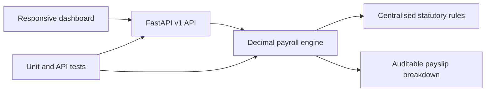

# KenPay, Kenyan Payroll System

A full-stack payroll demonstration built for Kenyan employers. It calculates PAYE, NSSF, SHIF, Affordable Housing Levy, net salary and total employer cost, then exposes the same calculation through a versioned REST API.

## Live demo

[Open the live KenPay dashboard](https://kenyan-payroll-system.kynkyra-9052.chatgpt.site). Select **Calculator**, change a salary value, and show the instant payslip breakdown.

## What this project demonstrates

- Domain modelling for Kenyan statutory payroll
- Decimal-safe calculations for financial data
- FastAPI and Pydantic REST API design
- Progressive tax-band and boundary handling
- Responsive, accessible front-end without a framework dependency
- Automated unit and API tests
- Docker packaging and GitHub Actions CI
- Centralised policy configuration for maintainable rate changes

## 2026 calculation rules

| Rule | Implementation |
| --- | --- |
| PAYE | Monthly bands of 10%, 25%, 30%, 32.5% and 35% |
| Personal relief | KES 2,400 per month for residents |
| NSSF Year 4 | 6%, lower limit KES 9,000, upper limit KES 108,000 |
| SHIF | 2.75% of gross pay, minimum KES 300 |
| Affordable Housing Levy | 1.5% employee and 1.5% employer |
| Pension tax deduction | Capped at KES 30,000 per month |

Statutory rates are centralised in `app/calculator.py`. This is demonstration software and should be validated against official guidance before production use.

## Run the API

```bash
python -m venv .venv
source .venv/bin/activate
pip install -r requirements-dev.txt
uvicorn app.main:app --reload
```

Open:

- API documentation: `http://127.0.0.1:8000/docs`
- Health check: `http://127.0.0.1:8000/health`
- Rates endpoint: `http://127.0.0.1:8000/api/v1/rates`

## API example

```bash
curl -X POST http://127.0.0.1:8000/api/v1/payroll/calculate \
  -H "Content-Type: application/json" \
  -d '{"basic_salary":120000,"allowances":15000,"pension":5000}'
```

## Run tests

```bash
pip install -r requirements-dev.txt
pytest -q
ruff check app tests
```

## Architecture



## Official references

- [KRA PAYE guide](https://www.kra.go.ke/images/publications/PAYE-AS-YOU-EARN-PAYE_4-01-2025.pdf)
- [NSSF Year 4 contribution notice](https://www.nssf.or.ke/notice-to-employers-year-4-2026-nssf-contribution-rates)
- [Social Health Authority](https://sha.go.ke/)

## Interview walkthrough

1. Open the dashboard and explain the payroll summary and audit status.
2. Open the calculator and change the basic salary to show reactive calculations.
3. Explain that policy values are centralised, not scattered through business logic.
4. Open `/docs` locally to demonstrate the API contract and validation.
5. Show the tests for tax-band boundaries, NSSF caps, reconciliation and invalid inputs.
