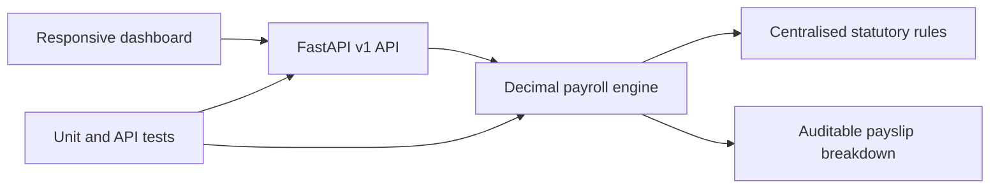

# KenPay, Kenyan Payroll System

A full-stack payroll demonstration built for Kenyan employers. It calculates PAYE, NSSF, SHIF, Affordable Housing Levy, net salary and total employer cost, then exposes the same calculation through a versioned REST API.

## Live demo

- [Application dashboard on Render](https://kenyan-payroll-system.onrender.com/)
- [Interactive API documentation](https://kenyan-payroll-system.onrender.com/docs)
- [Health check](https://kenyan-payroll-system.onrender.com/health)
- [Current statutory rates](https://kenyan-payroll-system.onrender.com/api/v1/rates)

## What this project demonstrates

- Domain modelling for Kenyan statutory payroll
- Decimal-safe calculations for financial data
- FastAPI and Pydantic REST API design
- Progressive tax-band and boundary handling
- Responsive, accessible front-end without a framework dependency
- Employee creation and employee search
- Downloadable payroll CSV reports
- Monthly metrics and annual payroll projections
- Single-employee, batch and annual projection APIs
- Automated unit and API tests
- Docker packaging and GitHub Actions CI
- Centralised policy configuration for maintainable rate changes

## 2026 calculation rules

| Rule | Implementation |
| --- | --- |
| PAYE | Monthly bands of 10%, 25%, 30%, 32.5% and 35% |
| Personal relief | KES 2,400 per month for residents |
| NSSF Year 4 | 6%, lower limit KES 9,000, upper limit KES 108,000 |
| SHIF | 2.75% of gross pay, minimum KES 300 |
| Affordable Housing Levy | 1.5% employee and 1.5% employer |
| Pension tax deduction | Capped at KES 30,000 per month |

Statutory rates are centralised in `app/calculator.py`. This is demonstration software and should be validated against official guidance before production use.

## Run the API

```bash
python -m venv .venv # Create an isolated Python environment.
source .venv/bin/activate # Activate the environment on macOS or Linux.
pip install -r requirements-dev.txt # Install the application and test dependencies.
uvicorn app.main:app --reload # Start the local development server.
```

Open:

- API documentation: `http://127.0.0.1:8000/docs`
- Health check: `http://127.0.0.1:8000/health`
- Rates endpoint: `http://127.0.0.1:8000/api/v1/rates`

## API example

```bash
curl -X POST -H "Content-Type: application/json" -d '{"basic_salary":120000,"allowances":15000,"pension":5000}' http://127.0.0.1:8000/api/v1/payroll/calculate # Request one payroll calculation with JSON input.
```

## Run tests

```bash
pip install -r requirements-dev.txt # Install the development and test packages.
pytest -q # Run the complete automated test suite.
ruff check app tests # Check Python code quality.
```

Every push is verified by [GitHub Actions](https://github.com/kimtour/kenyan-payroll-system/actions). Read the [demonstration guide](docs/DEMO_GUIDE.md) for a focused product walkthrough and [build-from-scratch guide](docs/BUILD_FROM_SCRATCH.md) for an explained setup process.

## Architecture



## Official references

- [KRA PAYE guide](https://www.kra.go.ke/images/publications/PAYE-AS-YOU-EARN-PAYE_4-01-2025.pdf)
- [NSSF Year 4 contribution notice](https://www.nssf.or.ke/notice-to-employers-year-4-2026-nssf-contribution-rates)
- [Social Health Authority](https://sha.go.ke/)

## Product walkthrough

1. Open the dashboard and explain the payroll summary and audit status.
2. Open the calculator and change the basic salary to show reactive calculations.
3. Explain that policy values are centralised, not scattered through business logic.
4. Search the employee register, add an employee and export the payroll CSV.
5. Review the annual projections and payroll ratios under **Reports**.
6. Open the [live API documentation](https://kenyan-payroll-system.onrender.com/docs) to inspect the API contract and validation.
7. Review the tests for tax-band boundaries, NSSF caps, reconciliation, batch processing and invalid inputs.
